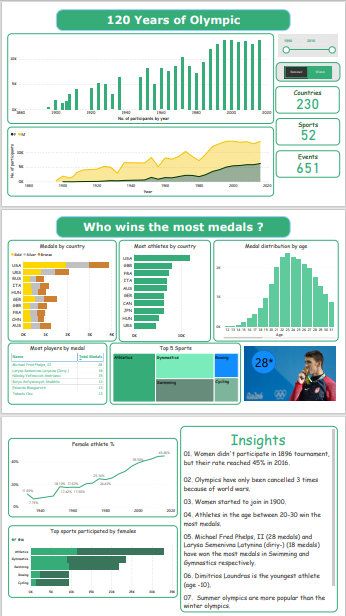

# Power Bi Tutorials
This repo contains the tips & tricks that I learnt from youtube channels and articles related to Power Bi. It covers with the topics and reference links.

# Power Projects
## 01. Olympics Data Analysis

## Power Bi Learnings
01. [Bidirectional filtering and dynamically disappearing values](https://www.youtube.com/watch?v=YC9OYdGlpP4)
